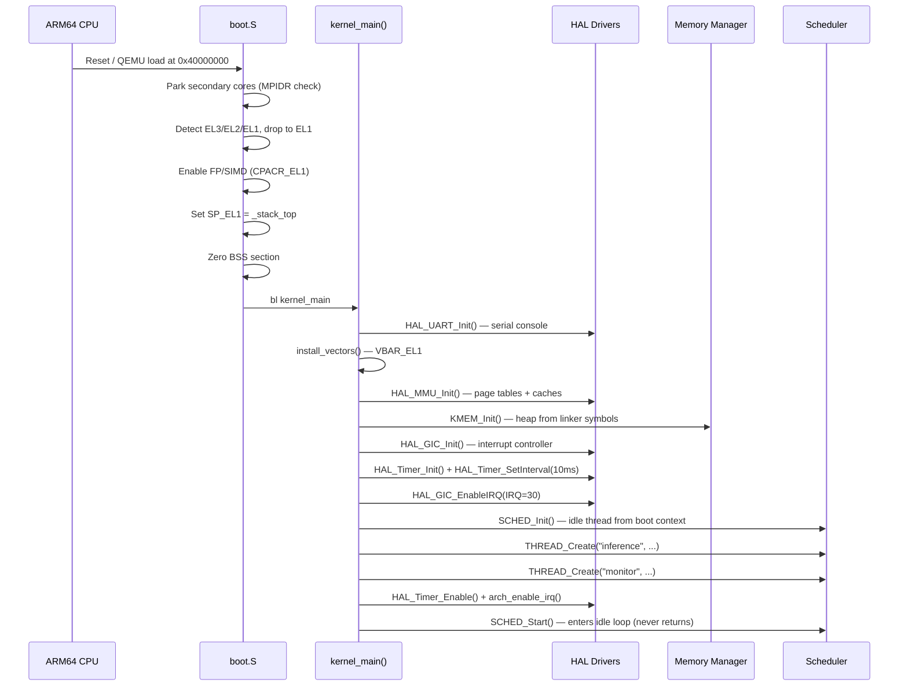
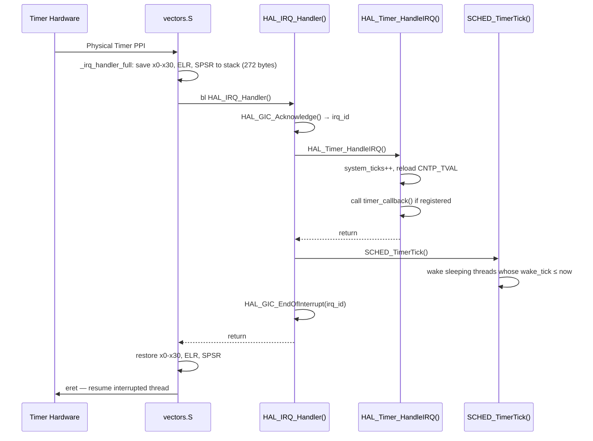
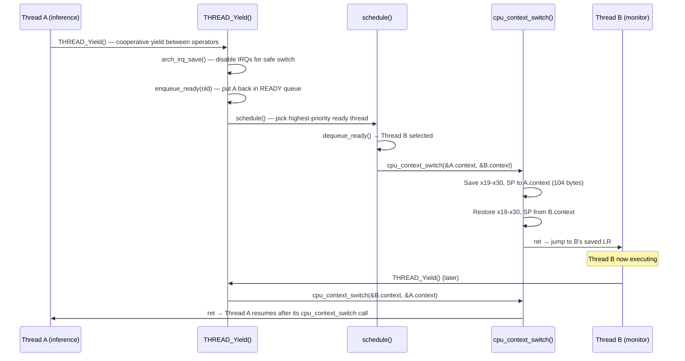
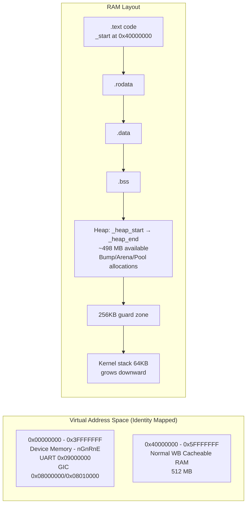
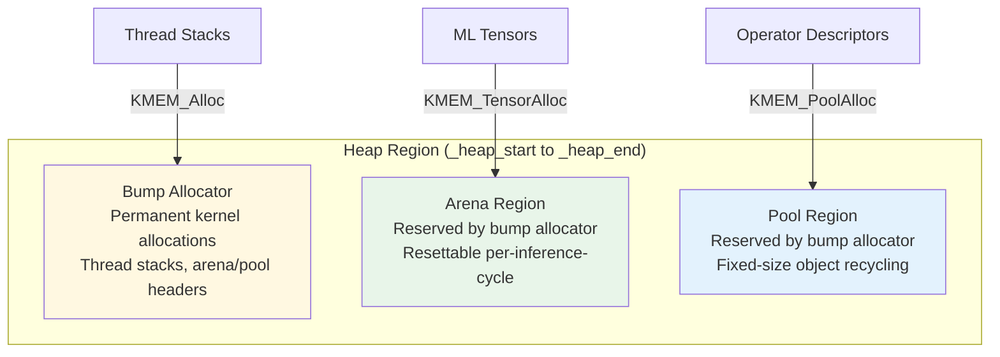
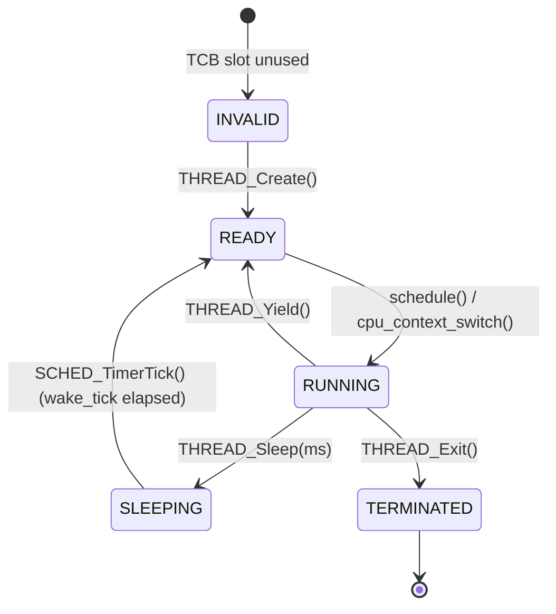
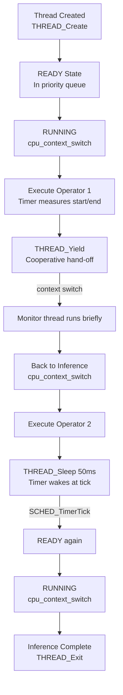
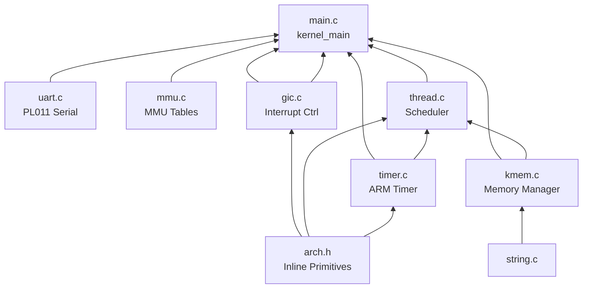

# MiniOS — ARM64 ML Inference Unikernel: Project Documentation

> **Version:** Kernel_API HEAD (commit `c370cb9`)  
> **Architecture:** ARM64 AArch64 (Cortex-A53)  
> **Platform:** QEMU `virt` machine  
> **Language:** C11 + ARM64 Assembly  
> **Date:** 2026-03-18

---

## Table of Contents

1. [Project Overview](#1-project-overview)
2. [System Architecture](#2-system-architecture)
3. [Directory Structure](#3-directory-structure)
4. [Boot & Initialization Subsystem](#4-boot--initialization-subsystem)
5. [Hardware Abstraction Layer (HAL)](#5-hardware-abstraction-layer-hal)
6. [Kernel Memory Manager (KMEM)](#6-kernel-memory-manager-kmem)
7. [Threading & Cooperative Scheduler](#7-threading--cooperative-scheduler)
8. [Utility Libraries](#8-utility-libraries)
9. [Type System & Status Codes](#9-type-system--status-codes)
10. [Linker Script & Memory Map](#10-linker-script--memory-map)
11. [Build System](#11-build-system)
12. [Data Flow Diagrams](#12-data-flow-diagrams)
13. [API Reference Summary](#13-api-reference-summary)

---

## 1. Project Overview

MiniOS is a specialized **unikernel operating system** designed to execute machine learning inference workloads on ARM64-based embedded platforms. Rather than being a general-purpose OS, it treats ML computation graphs as the primary execution unit and eliminates all traditional OS overhead (filesystem, multi-user management, POSIX compatibility) that is irrelevant to inference.

### Design Philosophy

| Principle | Implementation |
|-----------|---------------|
| **Single Address Space** | No user/kernel boundary; one flat 512MB RAM segment |
| **Cooperative Execution** | Threads yield voluntarily; timer ticks wake sleepers only |
| **Static Allocation** | All memory pre-allocated; no runtime `malloc`/`free` |
| **Graph-Centric** | Designed to host ML operator pipelines |
| **Minimalism** | <256KB code footprint; no dependencies beyond compiler runtime |

### Target Hardware

- **Primary:** QEMU `virt` machine with Cortex-A53 CPU, 512 MB RAM
- **Physical targets:** Raspberry Pi 3/4, NVIDIA Jetson Nano, generic ARM64 boards
- **Toolchain:** `aarch64-elf-gcc` 10+ or Clang 12+

---

## 2. System Architecture

### 2.1 High-Level Architecture

```mermaid
graph TB
    subgraph "Physical Hardware / QEMU virt"
        HW[ARM64 Cortex-A53 CPU]
        MMIO[Memory-Mapped I/O\nUART · GIC · Timer]
        RAM[512 MB DRAM\n0x40000000-0x5FFFFFFF]
    end

    subgraph "MiniOS Kernel Image"
        BOOT[boot.S\n_start entry point]
        subgraph HAL[Hardware Abstraction Layer]
            UART[uart.c\nPL011 Serial Driver]
            MMU[mmu.c\nMMU + Cache Setup]
            GIC[gic.c\nGICv2 Interrupt Controller]
            TMR[timer.c\nARM Generic Timer]
            ARCH[arch.h\nInline ARM64 Primitives]
        end
        subgraph KERNEL[Kernel Core]
            MAIN[main.c\nkernel_main()  IRQ Dispatch]
            KMEM[kmem.c\nBump · Arena · Pool Allocators]
            THREAD[thread.c\nCooperative Scheduler + TCBs]
            CTX[context.S\nCPU Context Switch]
        end
        subgraph LIB[Freestanding Libraries]
            STR[string.c\nmemset · memcpy · strlen]
        end
        subgraph APP[Application Threads]
            INF[inference_thread\nSimulated ML Workload]
            MON[monitor_thread\nMemory + Uptime Monitor]
            IDLE[idle thread\nWFE low-power loop]
        end
    end

    BOOT --> HAL
    BOOT --> KERNEL
    KERNEL --> APP
    HAL --> MMIO
    MMIO --> HW
    RAM --> KERNEL
```

### 2.2 Boot Sequence



### 2.3 Interrupt Handling Flow



### 2.4 Context Switch Flow



### 2.5 Memory Layout



---

## 3. Directory Structure

```
MiniOS/
├── Makefile                   # Build system (aarch64-elf-gcc, QEMU)
├── linker.ld                  # Linker script: memory map & section layout
├── include/
│   ├── types.h                # Fundamental types (uint8_t, size_t, bool, etc.)
│   ├── status.h               # Status code enum + STATUS_ToString()
│   ├── hal/
│   │   ├── arch.h             # Inline ARM64 primitives (IRQ, barriers, WFE)
│   │   ├── uart.h             # PL011 UART driver API
│   │   ├── mmu.h              # MMU / cache management API
│   │   ├── gic.h              # GICv2 interrupt controller API
│   │   └── timer.h            # ARM Generic Timer API
│   ├── kernel/
│   │   ├── kapi.h             # Master include: KERNEL_Init() + KERNEL_Start()
│   │   ├── kmem.h             # Memory management API (bump/arena/pool)
│   │   └── thread.h           # Threading API, cpu_context_t, thread_t TCB
│   └── lib/
│       └── string.h           # Freestanding string/memory utilities
├── src/
│   ├── boot/
│   │   ├── boot.S             # Entry point: EL detection, stack, BSS clear
│   │   └── vectors.S          # ARMv8-A exception vector table + IRQ handler
│   ├── hal/
│   │   ├── uart.c             # PL011 UART: init, putchar, getchar, putstring
│   │   ├── mmu.c              # Identity-mapped page tables, MAIR/TCR/SCTLR
│   │   ├── gic.c              # GICv2 distributor + CPU interface
│   │   └── timer.c            # Physical counter, delay, IRQ reload
│   ├── kernel/
│   │   ├── main.c             # kernel_main(), IRQ dispatcher, demo threads
│   │   ├── kmem.c             # Bump/arena/pool allocator implementation
│   │   ├── thread.c           # TCB management, cooperative scheduler
│   │   └── context.S          # cpu_context_switch + _thread_entry_trampoline
│   └── lib/
│       └── string.c           # memset, memcpy, strlen
├── scripts/
│   └── run.sh                 # QEMU launch helper
└── results/
    └── benchmark_output_*.txt # Unikraft vs Linux benchmark records
```

---

## 4. Boot & Initialization Subsystem

### 4.1 `src/boot/boot.S` — ARM64 Entry Point

The very first code executed when QEMU loads the kernel at `0x40000000`.

#### Functions / Labels

| Label | Description |
|-------|-------------|
| `_start` | Global entry point; reads `MPIDR_EL1` to identify CPU core |
| `.Lpark` | Infinite WFE loop for secondary CPU cores (cores 1–N) |
| `.Lprimary_core` | Core 0 continues here after parking secondaries |
| `.Lfrom_el3` | EL3→EL2 drop via `eret` (sets `SCR_EL3`, `SPSR_EL3`) |
| `.Lfrom_el2` | EL2→EL1 drop: configures `HCR_EL2`, `CPTR_EL2`, `CNTHCTL_EL2`, `SCTLR_EL1` |
| `.Lat_el1` | Enable FP/SIMD via `CPACR_EL1`, load `SP_EL1 = _stack_top` |
| `.Lbss_loop` | Zeroes `.bss` section 8 bytes at a time |
| `.Lhalt` | Infinite WFE if `kernel_main()` ever returns |

**Key Registers Configured:**
- `HCR_EL2.RW = 1` — EL1 is AArch64
- `CPACR_EL1.FPEN = 0b11` — NEON/FP fully enabled
- `SPSR_EL2 = 0x3C5` — DAIF masked, EL1h mode

---

### 4.2 `src/boot/vectors.S` — Exception Vector Table

Implements the ARMv8-A required 2KB-aligned exception vector table and the full IRQ handler.

#### Macros

| Macro | Description |
|-------|-------------|
| `VECTOR_ENTRY label` | Creates a 128-byte-aligned vector entry |
| `EXCEPTION_STUB id` | Loads exception ID into `x0`, branches to `_exception_handler` |

#### Key Symbols

| Symbol | Description |
|--------|-------------|
| `_vector_table` | Base address set in `VBAR_EL1`. Contains 16 entries (4 groups × 4 types) |
| `_vec_el1_spx_irq` | The live IRQ vector; branches to `_irq_handler_full` instead of stub |
| `_exception_handler` | Common fault handler: reads `ESR_EL1`, `ELR_EL1`, `FAR_EL1`; calls `HAL_Exception_Handler()` |
| `_irq_handler_full` | **Full IRQ handler**: saves all 31 GPRs + ELR/SPSR (272 bytes), calls `HAL_IRQ_Handler()`, restores, `eret` |

**Stack Frame Layout in `_irq_handler_full`:**
```
[sp+0]–[sp+240]  : x0–x30 (31 registers)
[sp+248]         : ELR_EL1
[sp+256]         : SPSR_EL1
[sp+264]–[sp+271]: padding (16-byte alignment)
Total: 272 bytes
```

**Vector Table Groups:**
| Group | Source | Vectors |
|-------|--------|---------|
| 0 | EL1 with SP0 | Sync(0), IRQ(1), FIQ(2), SError(3) |
| 1 | EL1 with SPx | Sync(4), **IRQ→_irq_handler_full**, FIQ(6), SError(7) |
| 2 | EL0 AArch64 | Sync(8), IRQ(9), FIQ(10), SError(11) |
| 3 | EL0 AArch32 | Sync(12), IRQ(13), FIQ(14), SError(15) |

---

## 5. Hardware Abstraction Layer (HAL)

### 5.1 `include/hal/arch.h` — ARM64 Inline Primitives

All functions are `static inline`, zero overhead.

| Function | Signature | Description |
|----------|-----------|-------------|
| `arch_enable_irq` | `void arch_enable_irq(void)` | Clears DAIF.I via `daifclr #2` — unmasks IRQs |
| `arch_disable_irq` | `void arch_disable_irq(void)` | Sets DAIF.I via `daifset #2` — masks IRQs |
| `arch_irq_save` | `uint64_t arch_irq_save(void)` | Saves DAIF register, then disables IRQs. Returns original flags |
| `arch_irq_restore` | `void arch_irq_restore(uint64_t flags)` | Restores DAIF from saved value — re-enables IRQs if they were on |
| `arch_dsb` | `void arch_dsb(void)` | Data Synchronization Barrier (`dsb sy`) — full system |
| `arch_isb` | `void arch_isb(void)` | Instruction Synchronization Barrier (`isb`) |
| `arch_dmb` | `void arch_dmb(void)` | Data Memory Barrier (`dmb sy`) |
| `arch_wfe` | `void arch_wfe(void)` | Wait-For-Event — low-power idle (wakes on event/IRQ) |
| `arch_wfi` | `void arch_wfi(void)` | Wait-For-Interrupt — deeper low-power idle |
| `arch_sev` | `void arch_sev(void)` | Send Event — wakes cores in WFE |
| `arch_get_el` | `uint32_t arch_get_el(void)` | Reads `CurrentEL`, returns EL number (0–3) |
| `arch_get_core_id` | `uint64_t arch_get_core_id(void)` | Reads `MPIDR_EL1`, returns Aff0 (core #) |

---

### 5.2 `src/hal/uart.c` — PL011 UART Driver

**Base Address:** `0x09000000` (QEMU virt PL011)  
**Baud Rate:** 115200, 8-N-1, FIFOs enabled  
**Mode:** Polling (no interrupts)

#### Internal Helpers

| Function | Description |
|----------|-------------|
| `uart_write_reg(offset, value)` | Writes 32-bit value to UART MMIO register |
| `uart_read_reg(offset)` | Reads 32-bit value from UART MMIO register |

#### Public API

| Function | Signature | Description |
|----------|-----------|-------------|
| `HAL_UART_Init` | `Status HAL_UART_Init(void)` | Disables UART → clears interrupts → sets IBRD=13/FBRD=2 for 115200 baud → configures `LCR_H` (8N1 + FIFO) → enables UART/TX/RX via `CR` |
| `HAL_UART_PutChar` | `void HAL_UART_PutChar(char c)` | Spin-waits until TX FIFO not full (`FR.TXFF == 0`), writes to DR |
| `HAL_UART_GetChar` | `char HAL_UART_GetChar(void)` | Spin-waits until RX FIFO not empty (`FR.RXFE == 0`), reads DR |
| `HAL_UART_PutString` | `void HAL_UART_PutString(const char *s)` | Iterates string; inserts `\r` before every `\n` for terminal compatibility |
| `HAL_UART_PutHex` | `void HAL_UART_PutHex(uint64_t value)` | Prints `0x` prefix then up to 16 hex digits, skipping leading zeros |
| `HAL_UART_PutDec` | `void HAL_UART_PutDec(uint64_t value)` | Converts integer to ASCII in local buffer, prints reversed |

**UART Register Offsets Used:**

| Register | Offset | Purpose |
|----------|--------|---------|
| `UART_DR` | 0x000 | Data Register |
| `UART_FR` | 0x018 | Flag Register (TXFF, RXFE bits) |
| `UART_IBRD` | 0x024 | Integer Baud Rate Divisor |
| `UART_FBRD` | 0x028 | Fractional Baud Rate Divisor |
| `UART_LCR_H` | 0x02C | Line Control Register |
| `UART_CR` | 0x030 | Control Register |
| `UART_IMSC` | 0x038 | Interrupt Mask |
| `UART_ICR` | 0x044 | Interrupt Clear |

---

### 5.3 `src/hal/mmu.c` — MMU & Cache Management

Sets up identity-mapped page tables. Uses **L1 block descriptors** (1GB granularity) for simplicity.

#### Internal Functions

| Function | Description |
|----------|-------------|
| `write_mair_el1(val)` | Configures memory attribute index registers |
| `write_tcr_el1(val)` | Configures translation control (T0SZ=32, 4KB granule, Inner/Outer WB) |
| `write_ttbr0_el1(val)` | Writes page table base address |
| `read_sctlr_el1()` | Reads System Control Register |
| `write_sctlr_el1(val)` | Writes System Control Register |
| `mmu_build_page_tables()` | Builds L1 table: Entry[0]=Device (0x00000000), Entry[1]=Normal RAM (0x40000000) |

#### Public API

| Function | Signature | Description |
|----------|-----------|-------------|
| `HAL_MMU_Init` | `Status HAL_MMU_Init(void)` | Full MMU setup: build tables → configure MAIR → set TCR → load TTBR0 → invalidate TLB → enable MMU+caches via SCTLR_EL1 (M=1, C=1, I=1) |
| `HAL_MMU_InvalidateTLB` | `void HAL_MMU_InvalidateTLB(void)` | `tlbi vmalle1` + `dsb` + `isb` — invalidates all EL1 TLB entries |
| `HAL_MMU_CleanInvalidateDCache` | `void HAL_MMU_CleanInvalidateDCache(void)` | Issues `dsb sy` + `isb` for cache coherence |

**Memory Attribute Index (MAIR_EL1):**
- `Attr0 = 0x00` → Device-nGnRnE (MMIO regions)
- `Attr1 = 0xFF` → Normal Write-Back, Read/Write Allocate (RAM)

**TCR_EL1 Configuration:**
- `T0SZ = 32` → 4GB address space
- `IRGN0/ORGN0 = 01` → Write-Back Inner/Outer Cacheable
- `SH0 = 11` → Inner Shareable
- `TG0 = 00` → 4KB granule

---

### 5.4 `src/hal/gic.c` — GICv2 Interrupt Controller

Configures the ARM Generic Interrupt Controller v2 for the QEMU virt machine.

**Base Addresses:**
- Distributor: `GIC_DIST_BASE = 0x08000000`
- CPU Interface: `GIC_CPU_BASE = 0x08010000`

#### Internal Helpers

| Function | Description |
|----------|-------------|
| `gic_dist_write/read(offset)` | Distributor register MMIO access |
| `gic_cpu_write/read(offset)` | CPU interface register MMIO access |

#### Public API

| Function | Signature | Description |
|----------|-----------|-------------|
| `HAL_GIC_Init` | `Status HAL_GIC_Init(void)` | 7-step init: disable distributor → read max IRQs → set all priorities to 0xA0 → target all SPIs to CPU0 → configure level-triggered → enable distributor → configure CPU interface (PMR=0xFF, BPR=0, enable) |
| `HAL_GIC_EnableIRQ` | `void HAL_GIC_EnableIRQ(uint32_t irq_id)` | Sets bit in `GICD_ISENABLER[irq_id/32]` to enable interrupt |
| `HAL_GIC_DisableIRQ` | `void HAL_GIC_DisableIRQ(uint32_t irq_id)` | Sets bit in `GICD_ICENABLER[irq_id/32]` to disable interrupt |
| `HAL_GIC_SetPriority` | `void HAL_GIC_SetPriority(uint32_t irq_id, uint8_t priority)` | Read-modify-write on `GICD_IPRIORITYR` for per-IRQ priority |
| `HAL_GIC_Acknowledge` | `uint32_t HAL_GIC_Acknowledge(void)` | Reads `GICC_IAR` to acknowledge IRQ; returns interrupt ID |
| `HAL_GIC_EndOfInterrupt` | `void HAL_GIC_EndOfInterrupt(uint32_t irq_id)` | Writes `GICC_EOIR` to signal end-of-interrupt to GIC |

**Interrupt routing:** Timer PPI (INTID 30) → CPU0 → EL1 IRQ handler

---

### 5.5 `src/hal/timer.c` — ARM Generic Timer

Uses the ARMv8 physical counter (`CNTPCT_EL0`) and physical timer (`CNTP_*_EL0`).

#### Internal State

| Variable | Type | Description |
|----------|------|-------------|
| `timer_freq` | `uint64_t` | Counter frequency in Hz (read from `CNTFRQ_EL0`) |
| `tick_interval_counts` | `uint64_t` | Counter ticks per timer period |
| `tick_period_us` | `uint32_t` | Timer period in microseconds (default 10,000 = 10ms) |
| `system_ticks` | `volatile uint64_t` | Monotonic tick counter, incremented in ISR |
| `timer_callback` | `timer_callback_t` | User-registered callback, called on each tick |

#### Internal Helpers (inline assembly)

| Helper | Description |
|--------|-------------|
| `read_cntpct()` | `mrs x, cntpct_el0` — free-running physical counter |
| `read_cntfrq()` | `mrs x, cntfrq_el0` — counter frequency |
| `write_cntp_tval(val)` | `msr cntp_tval_el0` — sets countdown value |
| `write_cntp_ctl(val)` | `msr cntp_ctl_el0` — enables/disables timer |

#### Public API

| Function | Signature | Description |
|----------|-----------|-------------|
| `HAL_Timer_Init` | `Status HAL_Timer_Init(void)` | Reads `CNTFRQ_EL0`, computes `tick_interval_counts` for 10ms, zeros `system_ticks`, disables timer |
| `HAL_Timer_GetTicks` | `uint64_t HAL_Timer_GetTicks(void)` | Returns raw `CNTPCT_EL0` value (free-running counter) |
| `HAL_Timer_GetFreq` | `uint64_t HAL_Timer_GetFreq(void)` | Returns cached counter frequency in Hz |
| `HAL_Timer_GetElapsedUs` | `uint64_t HAL_Timer_GetElapsedUs(uint64_t start_ticks)` | Computes `(now - start) * 1,000,000 / freq` — elapsed microseconds |
| `HAL_Timer_DelayUs` | `void HAL_Timer_DelayUs(uint64_t us)` | Busy-waits by spinning on `CNTPCT_EL0` until target ticks reached |
| `HAL_Timer_SetInterval` | `void HAL_Timer_SetInterval(uint64_t us)` | Reconfigures tick period; updates `tick_interval_counts` |
| `HAL_Timer_Enable` | `void HAL_Timer_Enable(void)` | Loads `CNTP_TVAL` with `tick_interval_counts`, sets `CNTP_CTL.ENABLE=1, IMASK=0` |
| `HAL_Timer_Disable` | `void HAL_Timer_Disable(void)` | Clears `CNTP_CTL` (disables timer + masks IRQ) |
| `HAL_Timer_AckInterrupt` | `void HAL_Timer_AckInterrupt(void)` | Reloads `CNTP_TVAL` with next interval (periodic reload) |
| `HAL_Timer_HandleIRQ` | `void HAL_Timer_HandleIRQ(void)` | ISR: increments `system_ticks`, calls `HAL_Timer_AckInterrupt()`, invokes callback if set |
| `HAL_Timer_SetCallback` | `void HAL_Timer_SetCallback(timer_callback_t cb)` | Registers a function to be called on every timer tick |
| `HAL_Timer_GetSystemTicks` | `uint64_t HAL_Timer_GetSystemTicks(void)` | Returns `system_ticks` — monotonic tick count since enable |
| `HAL_Timer_GetTickPeriodMs` | `uint32_t HAL_Timer_GetTickPeriodMs(void)` | Returns `tick_period_us / 1000` — tick period in milliseconds |

---

## 6. Kernel Memory Manager (KMEM)

`src/kernel/kmem.c` implements three complementary allocation strategies over a linker-defined heap region (`_heap_start` to `_heap_end`).



### 6.1 Internal Structures

#### `struct kmem_arena` (opaque)
```c
struct kmem_arena {
    uint8_t *base;      // Start of arena data
    uint8_t *current;   // Current bump pointer
    uint8_t *end;       // End of arena
    size_t   total;     // Total capacity
    size_t   used;      // Bytes currently allocated
    size_t   peak;      // Peak usage watermark
};
```

#### `struct kmem_pool` (opaque)
```c
struct kmem_pool {
    pool_node_t *free_list; // Head of free-list (intrusive linked list)
    uint8_t     *base;      // Pool data start
    size_t       elem_size; // Size of each element (aligned)
    size_t       capacity;  // Total number of elements
    size_t       used;      // Currently allocated elements
};
```

#### Global Heap State
```c
static struct {
    uint8_t *base, *current, *end;
    size_t total, used, peak;
    uint32_t alloc_count;
    bool initialized;
    size_t arena_total, arena_used;
    size_t pool_total, pool_used;
} heap;
```

### 6.2 Alignment Constants

| Constant | Value | Use |
|----------|-------|-----|
| `KMEM_CACHE_LINE` | 64 bytes | ARM64 Cortex-A53 cache line |
| `KMEM_MIN_ALIGN` | 8 bytes | Pointer-sized minimum |
| `KMEM_TENSOR_ALIGN` | 64 bytes | NEON SIMD-optimized tensor buffers |

### 6.3 Public API

#### Core Heap (Bump Allocator)

| Function | Complexity | Description |
|----------|------------|-------------|
| `KMEM_Init()` | O(1) | Reads `_heap_start/_heap_end` from linker, page-aligns start, initializes state |
| `KMEM_Alloc(size, alignment)` | O(1) | Bump-pointer allocation; enforces power-of-2 alignment ≥ 8. Never frees individual allocations |
| `KMEM_GetFreeSpace()` | O(1) | Returns `end - current` |
| `KMEM_GetStats(stats*)` | O(1) | Fills `kmem_stats_t` with heap/arena/pool statistics |

#### Arena Allocator (Resettable)

| Function | Complexity | Description |
|----------|------------|-------------|
| `KMEM_ArenaCreate(size)` | O(1) | Allocates arena header + data region from bump allocator, cache-line aligned |
| `KMEM_ArenaAlloc(arena, size, alignment)` | O(1) | Bump-pointer within arena; updates global `arena_used` stats |
| `KMEM_ArenaReset(arena)` | O(1) | Resets `current = base`, clears `used` — bulk free |
| `KMEM_ArenaGetUsed(arena)` | O(1) | Returns bytes currently allocated from arena |
| `KMEM_ArenaGetTotal(arena)` | O(1) | Returns total arena capacity |

#### Pool Allocator (Fixed-Size)

| Function | Complexity | Description |
|----------|------------|-------------|
| `KMEM_PoolCreate(elem_size, count)` | O(n) | Allocates pool + builds intrusive free-list (n insertions) |
| `KMEM_PoolAlloc(pool)` | O(1) | Pops head of free-list |
| `KMEM_PoolFree(pool, ptr)` | O(1) | Pushes ptr onto free-list head |
| `KMEM_PoolGetUsed(pool)` | O(1) | Returns count of allocated elements |

#### Tensor Memory (Convenience Wrappers)

| Function | Description |
|----------|-------------|
| `KMEM_TensorAlloc(arena, size)` | `KMEM_ArenaAlloc(arena, size, KMEM_TENSOR_ALIGN)` — 64-byte aligned |
| `KMEM_TensorAllocZeroed(arena, size)` | Same as above + `memset(ptr, 0, size)` |

---

## 7. Threading & Cooperative Scheduler

### 7.1 Thread Model



### 7.2 Priority Queue Architecture

```mermaid
graph LR
    subgraph "Ready Queues (4 priority levels)"
        H0[HIGH prio=0\nhead→tail FIFO]
        H1[NORMAL prio=1\nhead→tail FIFO]
        H2[LOW prio=2\nhead→tail FIFO]
        H3[IDLE prio=3\nhead→tail FIFO]
    end
    SCH[schedule()\ndequeue_ready()\npicks lowest prio# first]
    H0 --> SCH
    H1 --> SCH
    H2 --> SCH
    H3 --> SCH
```

### 7.3 Key Data Structures

#### `cpu_context_t` — 104 bytes (must match `context.S` offsets exactly)

| Offset | Field | Register | Description |
|--------|-------|----------|-------------|
| 0 | `x19` | x19 | Callee-saved |
| 8 | `x20` | x20 | Callee-saved (holds thread func ptr at start) |
| 16 | `x21` | x21 | Callee-saved |
| 24 | `x22` | x22 | Callee-saved |
| 32 | `x23` | x23 | Callee-saved |
| 40 | `x24` | x24 | Callee-saved |
| 48 | `x25` | x25 | Callee-saved |
| 56 | `x26` | x26 | Callee-saved |
| 64 | `x27` | x27 | Callee-saved |
| 72 | `x28` | x28 | Callee-saved |
| 80 | `fp` | x29 | Frame pointer |
| 88 | `lr` | x30 | Return address → `_thread_entry_trampoline` on first switch |
| 96 | `sp` | SP | Stack pointer |

#### `thread_t` — Thread Control Block (TCB)

```c
typedef struct thread {
    cpu_context_t  context;       // MUST be first (context.S assumes offset 0)
    uint32_t       id;            // Unique thread ID
    char           name[16];      // Human-readable name
    thread_state_t state;         // INVALID/READY/RUNNING/SLEEPING/BLOCKED/TERMINATED
    uint8_t        priority;      // 0=HIGH ... 3=IDLE
    uint8_t       *stack_base;    // Allocated stack region
    size_t         stack_size;    // Stack size in bytes (default 8KB)
    uint64_t       wake_tick;     // system_ticks value to wake from sleep
    uint64_t       total_ticks;   // Lifetime tick accumulator
    struct thread *next;          // Next pointer for ready queue linkage
} thread_t;
```

**Limits:**
- `THREAD_MAX_COUNT = 16` (including idle)
- `THREAD_DEFAULT_STACK = 8192` bytes
- `THREAD_NAME_MAX = 16` chars

### 7.4 Thread API

#### `src/kernel/thread.c`

| Function | Signature | Description |
|----------|-----------|-------------|
| `THREAD_Create` | `Status THREAD_Create(thread_t **out, const char *name, thread_func_t func, void *arg, uint8_t priority, size_t stack_size)` | Allocates stack from heap (16-byte aligned), initializes TCB, sets `context.lr = _thread_entry_trampoline`, `context.x19 = func`, `context.x20 = arg`, enqueues in ready queue |
| `THREAD_Yield` | `void THREAD_Yield(void)` | Disables IRQs, re-enqueues current thread as READY, calls `schedule()` |
| `THREAD_Exit` | `void THREAD_Exit(void)` | Sets state to TERMINATED, calls `schedule()` (does not return) |
| `THREAD_Sleep` | `void THREAD_Sleep(uint64_t ms)` | Computes `wake_tick`, sets state to SLEEPING, calls `schedule()` |
| `THREAD_GetCurrent` | `thread_t *THREAD_GetCurrent(void)` | Returns `current_thread` pointer |
| `THREAD_GetID` | `uint32_t THREAD_GetID(void)` | Returns `current_thread->id` |

#### Scheduler API

| Function | Signature | Description |
|----------|-----------|-------------|
| `SCHED_Init` | `Status SCHED_Init(void)` | Creates idle thread (ID 0) from current boot stack. Initializes all priority queues. Sets `thread_count = 1` |
| `SCHED_Start` | `void SCHED_Start(void)` | Enters infinite `THREAD_Yield() + arch_wfe()` loop (never returns). Boot stack becomes idle thread |
| `SCHED_TimerTick` | `void SCHED_TimerTick(void)` | Called from timer ISR. Scans all TCBs for sleeping threads. Wakes those with `wake_tick ≤ system_ticks` by moving to READY |
| `SCHED_GetThreadCount` | `uint32_t SCHED_GetThreadCount(void)` | Returns `thread_count` |
| `SCHED_GetUptime` | `uint64_t SCHED_GetUptime(void)` | Returns `system_ticks * tick_period_ms` in milliseconds |

#### Internal Helpers (static)

| Function | Description |
|----------|-------------|
| `copy_name(dst, src, max)` | Safe string copy with null termination |
| `enqueue_ready(t)` | Appends thread to tail of its priority queue (O(1)) |
| `dequeue_ready()` | Scans queues 0→3, dequeues head of first non-empty (O(1)) |
| `schedule()` | Core logic: calls `dequeue_ready()`, performs `cpu_context_switch()` if different thread selected |

---

### 7.5 `src/kernel/context.S` — Context Switch Implementation

#### `cpu_context_switch(old_ctx*, new_ctx*)`

```
Parameters: x0 = old_ctx, x1 = new_ctx
Save:    stp x19-x30 + str SP to old_ctx
Restore: ldp x19-x30 + ldr SP from new_ctx
Return:  ret → jumps to new_ctx.lr
```

**First-run behavior:** For a freshly created thread, `context.lr = _thread_entry_trampoline`. When `cpu_context_switch` restores this context and executes `ret`, execution jumps to the trampoline.

#### `_thread_entry_trampoline`

1. `msr daifclr, #2` — re-enables IRQs (disabled during context switch)
2. `mov x0, x20` — loads `arg` into first argument register
3. `blr x19` — calls the thread function `func(arg)`
4. `bl THREAD_Exit` — if `func` returns, clean up

---

## 8. Utility Libraries

### 8.1 `src/lib/string.c` — Freestanding String Library

Required by GCC even with `-nostdlib`. Optimized for 8-byte aligned access.

| Function | Signature | Description |
|----------|-----------|-------------|
| `memset` | `void *memset(void *s, int c, size_t n)` | For zeroing (c=0): word-fills 8 bytes at a time after aligning to 8-byte boundary; then byte-fills remainder |
| `memcpy` | `void *memcpy(void *dest, const void *src, size_t n)` | 8-byte word copy when both src/dest are 8-byte aligned; otherwise byte copy |
| `strlen` | `size_t strlen(const char *s)` | Forward scan until null terminator |

---

## 9. Type System & Status Codes

### 9.1 `include/types.h`

Provides `uint8_t`, `uint16_t`, `uint32_t`, `uint64_t`, `size_t`, `uintptr_t`, `bool`, `true`, `false` in a freestanding environment (no standard library).

### 9.2 `include/status.h` — Status Code Enum

All MiniOS functions return `Status` following the SRS error handling pattern.

| Code | Value | Category |
|------|-------|----------|
| `STATUS_OK` | 0 | Success |
| `STATUS_ERROR_INVALID_ARGUMENT` | 1 | General |
| `STATUS_ERROR_NOT_SUPPORTED` | 2 | General |
| `STATUS_ERROR_NOT_INITIALIZED` | 3 | General |
| `STATUS_ERROR_OUT_OF_MEMORY` | 4 | Memory |
| `STATUS_ERROR_MEMORY_ALIGNMENT` | 5 | Memory |
| `STATUS_ERROR_MEMORY_PROTECTION` | 6 | Memory |
| `STATUS_ERROR_HARDWARE_FAULT` | 7 | Hardware |
| `STATUS_ERROR_TIMEOUT` | 8 | Hardware |
| `STATUS_ERROR_EXECUTION_FAILED` | 9 | Execution |
| `STATUS_ERROR_EXECUTION_TIMEOUT` | 10 | Execution |
| `STATUS_ERROR_INVALID_GRAPH` | 11 | ML/Graph |
| `STATUS_ERROR_UNSUPPORTED_OPERATOR` | 12 | ML/Graph |
| `STATUS_ERROR_SHAPE_MISMATCH` | 13 | ML/Graph |
| `STATUS_ERROR_COMM_FAILURE` | 14 | Communication |
| `STATUS_ERROR_CRC_MISMATCH` | 15 | Communication |
| `STATUS_ERROR_THREAD_LIMIT` | 16 | Threading |
| `STATUS_ERROR_SCHEDULER_ACTIVE` | 17 | Threading |
| `STATUS_ERROR_POOL_EXHAUSTED` | 18 | Memory |

**`STATUS_ToString(status)`** — converts any status code to a human-readable string; implemented in `main.c`.

### 9.3 `include/kernel/kapi.h` — Unified Kernel API Header

Master include aggregating all subsystem headers. Defines:

| Function | Description |
|----------|-------------|
| `KERNEL_Init()` | Initialize subsystems in order: KMEM → HAL_GIC → HAL_Timer → SCHED |
| `KERNEL_Start()` | Enable timer IRQs, unmask interrupts, start scheduler (never returns) |

---

## 10. Linker Script & Memory Map

`linker.ld` defines the kernel image layout for the QEMU virt machine (RAM at `0x40000000`, 512MB).

```
0x40000000 ┌────────────────────────────┐
           │ .text.boot  (_start)       │ ← boot.S must be first
           │ .text       (all code)     │
           │ .rodata     (read-only)    │
           │ .data       (initialized)  │
           │ .bss        (zero-init)    │
           │────────────────────────────│ _heap_start (page-aligned after BSS)
           │                            │
           │   HEAP (~498 MB)           │ Available for KMEM_Alloc
           │   Bump / Arena / Pool      │
           │                            │
           │────────────────────────────│ _heap_end = _stack_top - 256KB
           │   256KB Guard Zone         │
           │────────────────────────────│ _stack_top - 64KB
           │   Kernel Stack (64KB)      │ SP_EL1, grows downward
0x5FFFFFFF └────────────────────────────┘ (top of 512MB RAM)
```

**Key Linker Symbols:**
- `_bss_start`, `_bss_end` — used by `boot.S` for BSS zeroing
- `_stack_top` — initial stack pointer loaded in `boot.S`
- `_heap_start`, `_heap_end` — used by `KMEM_Init()` for heap boundaries

---

## 11. Build System

### Toolchain

| Tool | Value |
|------|-------|
| Cross prefix | `aarch64-elf-` |
| Compiler | `aarch64-elf-gcc` |
| Assembler | `aarch64-elf-as` |
| Linker | `aarch64-elf-ld` |
| Objcopy | `aarch64-elf-objcopy` |

### Compiler Flags

| Flag | Purpose |
|------|---------|
| `-std=c11` | C11 standard compliance |
| `-ffreestanding` | No OS-provided libraries |
| `-nostdlib -nostartfiles` | No standard startup/library |
| `-mcpu=cortex-a53` | Target Cortex-A53 instruction set |
| `-Wall -Wextra -Werror` | Strict warnings as errors |
| `-O2` | Optimization level 2 |
| `-g` | Debug symbols |

### Build Targets

| Target | Command | Description |
|--------|---------|-------------|
| `all` | `make` | Compiles all sources, links ELF, creates binary |
| `run` | `make run` | Launches QEMU with `-nographic`, Ctrl+A X to exit |
| `debug` | `make debug` | Launches QEMU with GDB stub on port 1234 |
| `disasm` | `make disasm` | Disassembles kernel ELF |
| `size` | `make size` | Prints section sizes |
| `clean` | `make clean` | Removes `build/` directory |

### QEMU Command

```bash
qemu-system-aarch64 -machine virt -cpu cortex-a53 -m 512M -nographic -kernel build/kernel.elf
```

### Source Compilation Order

```
boot.S → vectors.S → context.S    (Assembly)
uart.c → mmu.c → gic.c → timer.c  (HAL)
string.c                            (Lib)
kmem.c → thread.c → main.c         (Kernel)
```

---

## 12. Data Flow Diagrams

### 12.1 ML Inference Thread Execution Model



### 12.2 Kernel Subsystem Dependencies



---

## 13. API Reference Summary

### Complete Function Index

| Module | Function | Returns | Notes |
|--------|----------|---------|-------|
| **arch.h** | `arch_enable_irq()` | void | Clears DAIF.I |
| | `arch_disable_irq()` | void | Sets DAIF.I |
| | `arch_irq_save()` | uint64_t | Save+disable IRQs |
| | `arch_irq_restore(flags)` | void | Restore DAIF |
| | `arch_dsb()` | void | Data sync barrier |
| | `arch_isb()` | void | Instruction sync barrier |
| | `arch_wfe()` | void | Low-power wait |
| | `arch_get_el()` | uint32_t | Current EL number |
| **uart.c** | `HAL_UART_Init()` | Status | 115200 8N1, FIFOs |
| | `HAL_UART_PutChar(c)` | void | Polling TX |
| | `HAL_UART_GetChar()` | char | Polling RX |
| | `HAL_UART_PutString(s)` | void | CR+LF aware |
| | `HAL_UART_PutHex(val)` | void | 0x + hex digits |
| | `HAL_UART_PutDec(val)` | void | Decimal integer |
| **mmu.c** | `HAL_MMU_Init()` | Status | Full MMU enable |
| | `HAL_MMU_InvalidateTLB()` | void | `tlbi vmalle1` |
| | `HAL_MMU_CleanInvalidateDCache()` | void | `dsb sy` + `isb` |
| **gic.c** | `HAL_GIC_Init()` | Status | Full GICv2 setup |
| | `HAL_GIC_EnableIRQ(id)` | void | ISENABLER bit |
| | `HAL_GIC_DisableIRQ(id)` | void | ICENABLER bit |
| | `HAL_GIC_SetPriority(id, p)` | void | IPRIORITYR RMW |
| | `HAL_GIC_Acknowledge()` | uint32_t | Read GICC_IAR |
| | `HAL_GIC_EndOfInterrupt(id)` | void | Write GICC_EOIR |
| **timer.c** | `HAL_Timer_Init()` | Status | Read freq, set 10ms default |
| | `HAL_Timer_GetTicks()` | uint64_t | Raw CNTPCT_EL0 |
| | `HAL_Timer_GetElapsedUs(start)` | uint64_t | Microsecond elapsed |
| | `HAL_Timer_DelayUs(us)` | void | Busy-wait delay |
| | `HAL_Timer_Enable()` | void | Start timer + IRQ |
| | `HAL_Timer_HandleIRQ()` | void | ISR: tick++ + reload |
| | `HAL_Timer_GetSystemTicks()` | uint64_t | Monotonic ticks |
| **kmem.c** | `KMEM_Init()` | Status | Heap from linker |
| | `KMEM_Alloc(size, align)` | void* | Bump alloc, O(1) |
| | `KMEM_ArenaCreate(size)` | kmem_arena_t* | Resettable region |
| | `KMEM_ArenaAlloc(a, sz, al)` | void* | Arena bump, O(1) |
| | `KMEM_ArenaReset(a)` | void | Bulk free, O(1) |
| | `KMEM_PoolCreate(sz, n)` | kmem_pool_t* | Fixed-size pool |
| | `KMEM_PoolAlloc(pool)` | void* | Free-list pop, O(1) |
| | `KMEM_PoolFree(pool, ptr)` | void | Free-list push, O(1) |
| | `KMEM_TensorAlloc(a, sz)` | void* | 64-byte aligned |
| | `KMEM_TensorAllocZeroed(a,sz)` | void* | 64-byte + zeroed |
| | `KMEM_GetStats(stats*)` | void | Usage snapshot |
| **thread.c** | `THREAD_Create(...)` | Status | Create + enqueue |
| | `THREAD_Yield()` | void | Cooperative hand-off |
| | `THREAD_Exit()` | void (noreturn) | Terminate thread |
| | `THREAD_Sleep(ms)` | void | Timer-woken sleep |
| | `SCHED_Init()` | Status | Create idle thread |
| | `SCHED_Start()` | void (noreturn) | Enter idle loop |
| | `SCHED_TimerTick()` | void | Wake sleeping threads |
| | `SCHED_GetUptime()` | uint64_t | Uptime in ms |
| **context.S** | `cpu_context_switch(old, new)` | void | Save/restore 104 bytes |

---

*End of MiniOS Project Documentation — Branch: `Kernel_API` (HEAD: `c370cb9`)*
