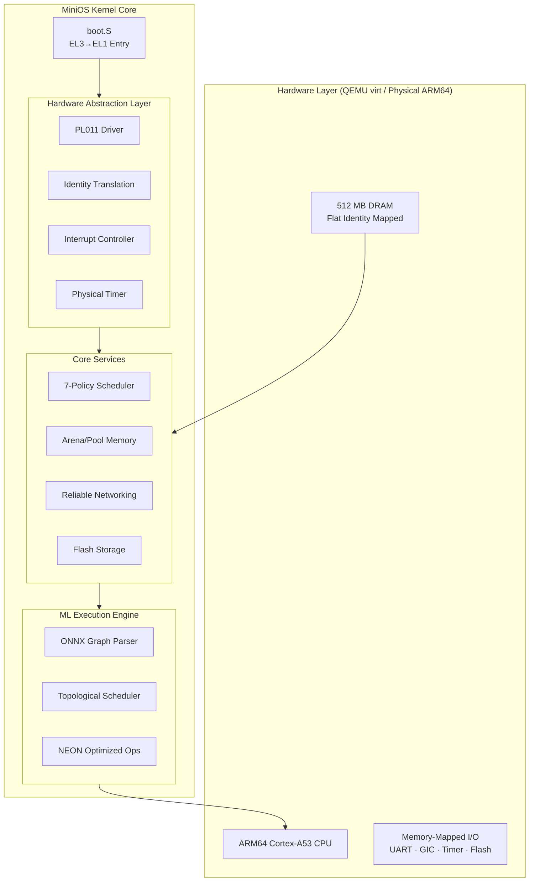

# 🪐 MiniOS — ARM64 ML Inference Unikernel

[](https://opensource.org/licenses/MIT)
[]()
[]()
[]()

> **"Minimum Overhead, Maximum Inference."**

MiniOS is a specialized, industry-grade **unikernel operating system** engineered from the ground up to execute machine learning inference workloads on **ARM64-based embedded platforms**. By stripping away the legacy bloat of general-purpose OSs (filesystems, multi-user management, POSIX overhead), MiniOS treats the ML computation graph as the primary execution unit, achieving unprecedented performance, predictability, and a minimal attack surface.

---

## 🚀 Key Features

| Component | Industry-Grade Capability |
|-----------|---------------------------|
| **ML Runtime** | Protobuf-based **ONNX** graph loader with a DAG-based topological scheduler. |
| **Networking** | High-reliability **RUDP** (Reliable UDP) stack for model loading and data telemetry. |
| **Storage** | **ULFS** (Ultra-Lightweight File System) with non-volatile flash persistence. |
| **Scheduling** | **7-Policy Cooperative Scheduler** (MLQ, Lottery, SJF, RR, etc.) for deterministic execution. |
| **Memory** | Strategic allocator suite: **Bump**, **Arena** (resettable), and **Pool** (fixed-size). |
| **Footprint** | Extremely lean kernel image (< 256KB) with zero external dependencies. |

---

## 🏗️ System Architecture

MiniOS follows a modular, layer-based architecture designed for low-latency hardware interaction.



---

## 📂 Project Structure

- **`src/boot/`**: AArch64 entry point, Exception Vector Table, and EL drop sequences.
- **`src/hal/`**: Performance-tuned drivers for UART, GICv2, MMU, and Generic Timer.
- **`src/kernel/`**: The heart of MiniOS, featuring the cooperative scheduler and memory manager.
- **`src/onnx/`**: Specialized runtime for parsing and executing ML computation graphs.
- **`src/net/`**: The RUDP networking stack for industrial-grade data reliability.
- **`include/`**: Unified API headers for seamless application development.

---

## ⚡ Quick Start

### Prerequisites
- `aarch64-none-elf-gcc` (or `aarch64-elf-gcc`)
- `qemu-system-aarch64`
- `make`

### Build and Run
1. **Clone the repository**:
   ```bash
   git clone https://github.com/Piyush2005-code/MiniOS.git
   cd MiniOS
   ```
2. **Compile the kernel**:
   ```bash
   make
   ```
3. **Launch in QEMU**:
   ```bash
   make run
   ```
*Tips: Use `Ctrl+A` then `X` to exit QEMU.*

---

## 📚 References & Bibliography

MiniOS development is guided by rigorous technical standards and academic research:

1.  **IEEE 830-1998**: *Recommended Practice for Software Requirements Specifications*. (Used for documentation baseline).
2.  **ARMv8-A Architecture Reference Manual**: Essential for Cortex-A53 system register management and GICv2 implementation.
3.  **ONNX v1.8 Specification**: The technical foundation for the Protobuf-based graph ingestion and operator dispatch.
4.  **RFC 908/1151 (RVM/RUDP)**: Conceptual inspiration for the high-reliability networking protocol implemented in `src/net/`.
5.  **Operating System Concepts (Silberschatz et al.)**: Theoretical basis for the 7-policy cooperative scheduling algorithms.
6.  **Unikernels (Madhavapeddy et al.)**: The architectural inspiration for the library-OS design pattern.

---

## 🤝 Contribution & Feedback

For structural improvements, branch representation, or feature requests, please refer to the `PROJECT_DOCUMENTATION.md`. We welcome technical feedback from the OS development community.

**Developed by the MiniOS Team.**  
*Empowering Edge AI with Unikernel Efficiency.*
oject
