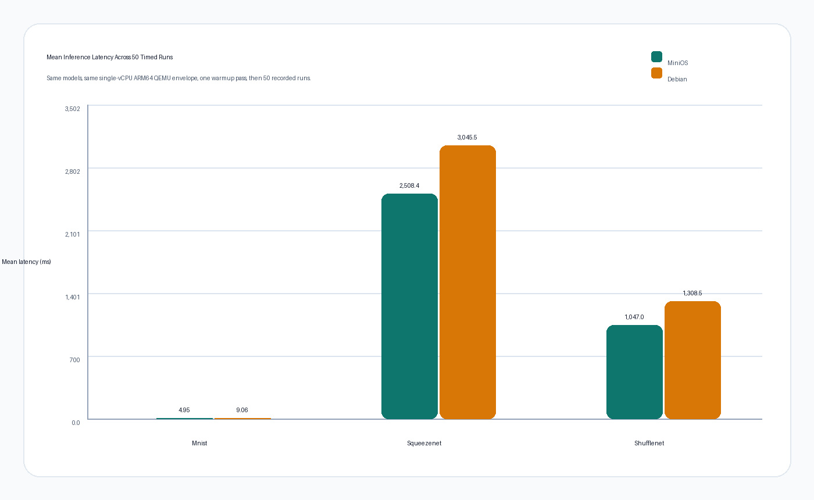
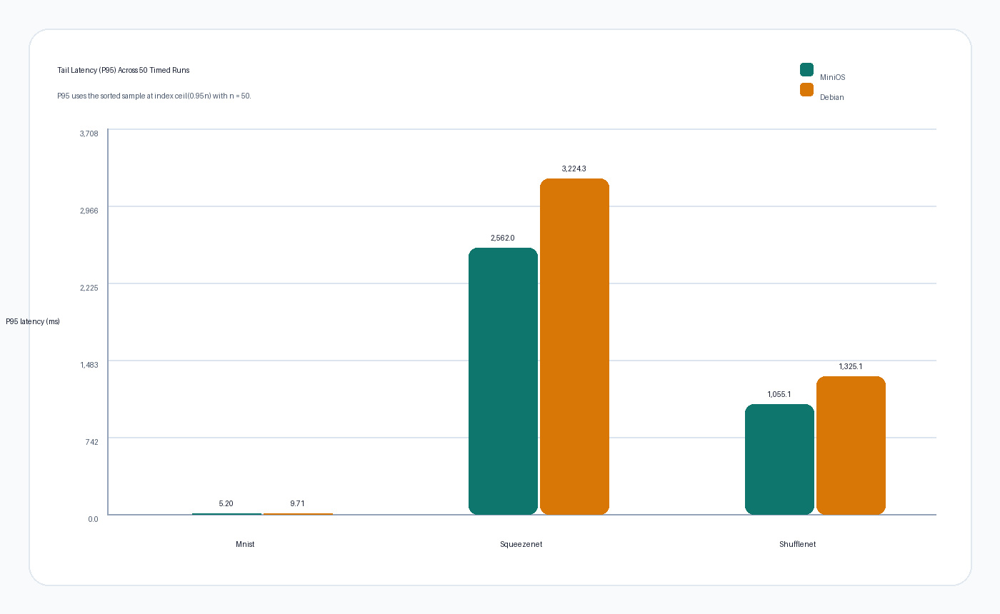
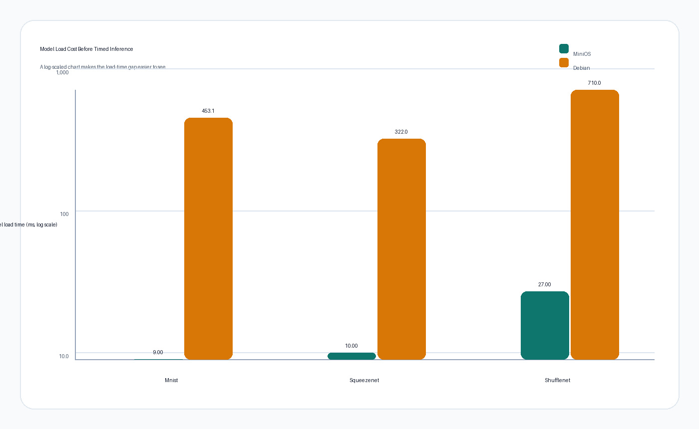
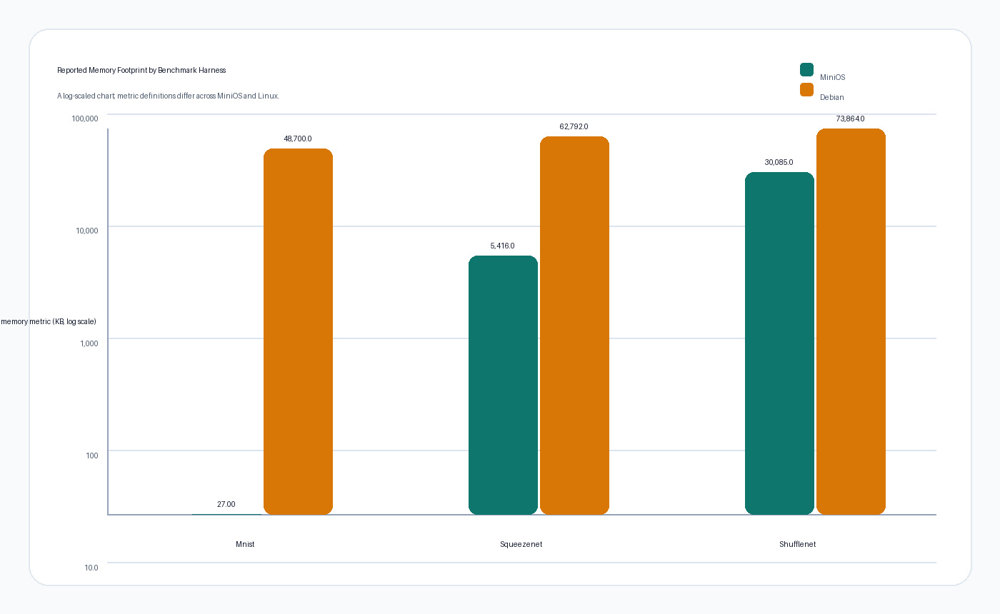
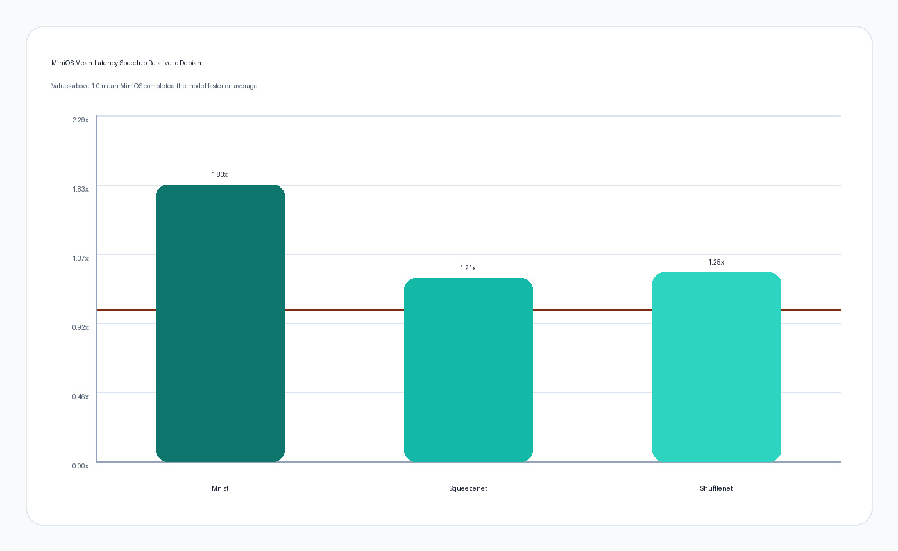
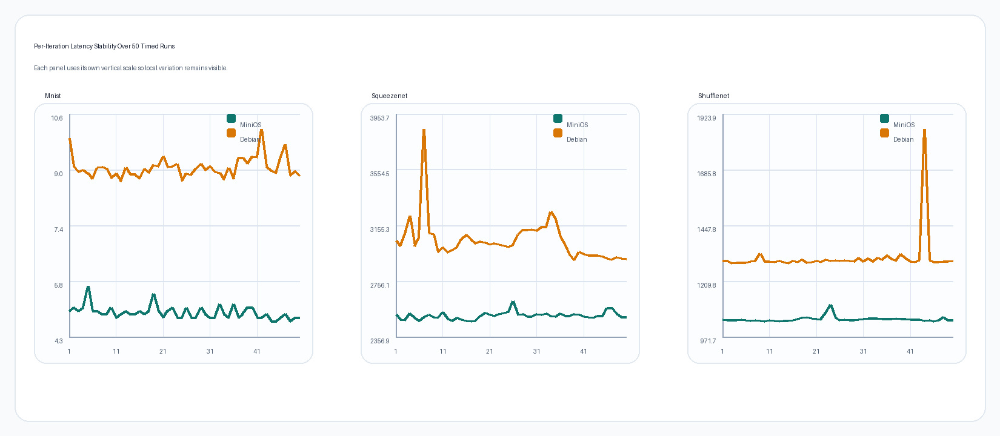

# MiniOS Benchmark Study

This branch contains a fresh benchmark study comparing MiniOS against a Debian 12 ARM64 baseline on the same QEMU `aarch64` envelope. The study uses three ONNX workloads:

- `mnist`
- `squeezenet`
- `shufflenet`

The benchmark protocol is intentionally simple and repeatable:

- one warmup run per model,
- 50 timed runs per model per OS,
- single-vCPU execution,
- same model and input pairs,
- separate measurement of model load time and inference latency,
- validation of every output JSON file.

The detailed methodology, formulas, codebase-backed explanation, and validity notes are documented in [results/comprehensive_benchmark_report_20260408.md](results/comprehensive_benchmark_report_20260408.md).

## Key Results

MiniOS was faster on all three models, with the strongest improvements in model load time and reported memory footprint. The gap is largest on `mnist`, while `squeezenet` and `shufflenet` still show clear wins in mean and p95 latency.

| Model | MiniOS mean ms | Debian mean ms | MiniOS p95 ms | Debian p95 ms | MiniOS load ms | Debian load ms |
| --- | ---: | ---: | ---: | ---: | ---: | ---: |
| mnist | 4.948 | 9.060 | 5.200 | 9.714 | 9.000 | 453.149 |
| squeezenet | 2508.436 | 3045.485 | 2562.000 | 3224.312 | 10.000 | 322.023 |
| shufflenet | 1046.990 | 1308.505 | 1055.100 | 1325.061 | 27.000 | 710.046 |

## Charts

### Mean latency

### P95 latency

### Model load time

### Reported memory footprint

### Speedup

### Stability across 50 runs

## What Explains MiniOS Performance Here

The codebase makes the performance story fairly clear:

- the tensor allocator uses a resettable arena instead of repeated hot-path heap churn,
- the runtime executes from a precomputed schedule instead of rebuilding graph order during inference,
- the benchmark path disables yield-between-node behavior, telemetry, and other background noise,
- interrupts are suppressed during the timed section to keep the measurement focused,
- the single-address-space cooperative scheduler matches the intended workload shape.

The result is a system that is specialized for low-overhead, repeated inference on a constrained machine model, which is exactly the workload this benchmark exercises.

## Benchmark Artifacts

- [MiniOS JSON outputs](results/mnist_minios_50.json), [mnist](results/mnist_minios_50.json), [squeezenet](results/squeezenet_minios_50.json), [shufflenet](results/shufflenet_minios_50.json)
- [Debian JSON outputs](results/mnist_debian_50.json), [mnist](results/mnist_debian_50.json), [squeezenet](results/squeezenet_debian_50.json), [shufflenet](results/shufflenet_debian_50.json)
- [Full report](results/comprehensive_benchmark_report_20260408.md)

## Notes

The memory field in the JSON files is not perfectly identical across the two systems:

- MiniOS reports tensor-arena usage.
- Debian reports Linux process `ru_maxrss`.

That means the memory comparison is directionally useful, but it should not be treated as a strict apples-to-apples RSS comparison.
